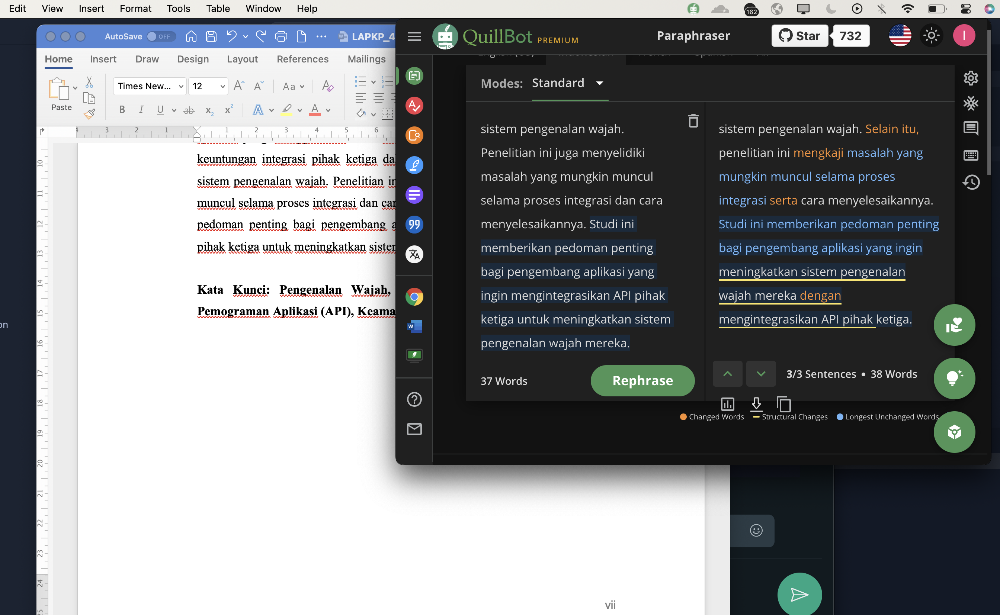

# Quillbot for desktop

This is a simple app that makes Quillbot live in your menubar.

You can use Cmd+Shift+G (Mac) or Ctrl+Shift+G (Win) to quickly open it from anywhere.

Download:

- [Mac Arm64 .dmg](https://github.com/corrykalam/quillbot-crack-mac/releases/download/v1.0.0/quillbot-crack-mac-arm64.dmg)
- [Mac Intel .dmg](https://github.com/corrykalam/quillbot-crack-mac/releases/download/v1.0.0/quillbot-crack-mac-x64.dmg)

No Windows binaries currently offered. Clone the repo, npm install electron-forge and run.

  

## Credit

All credit and copyrights goes to quillbot.

## Author

You can find me on Twitter [@corrykalam](https://twitter.com/corrykalam).

### Special thanks

- [@vincelwt](https://github.com/vincelwt)
- [@blueagler](https://github.com/blueagler)
